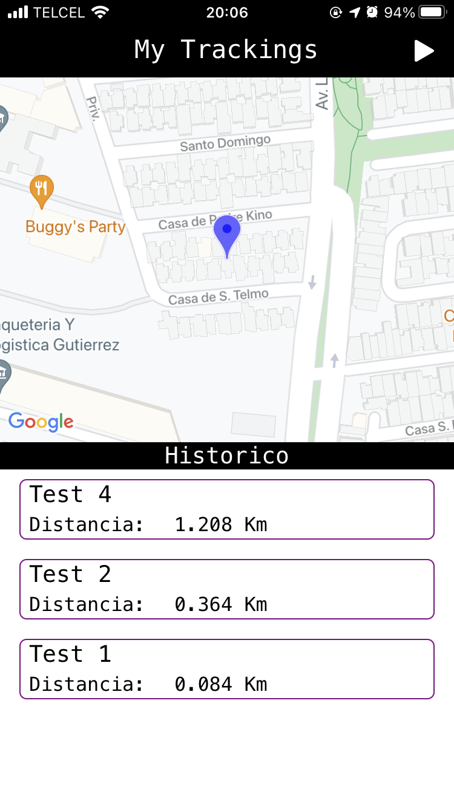
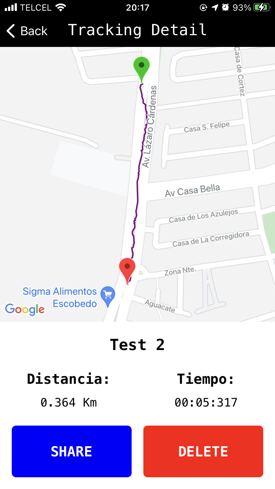

# GCTest

Prueba tecnica para GrainChain.

## Instalación

Utilizar [CocoaPods](https://cocoapods.org/) para instalar las dependencias del proyecto.

```bash
$ pod install
```

## Funcionalidad

### Pantalla Principal


* Se muestra un mapa con la ubicación actual del usuario.
* Tabla con el histórico de rutas guardadas previamente.
* Botón para iniciar un nuevo recorrido.

### Pantalla de Detalle


* Mapa con la ruta trazada por el usuario.
* Información del tiempo y distancia del recorrido.
* Botones para compartir y eliminar la ruta.

## Licencia
[MIT](https://choosealicense.com/licenses/mit/)
